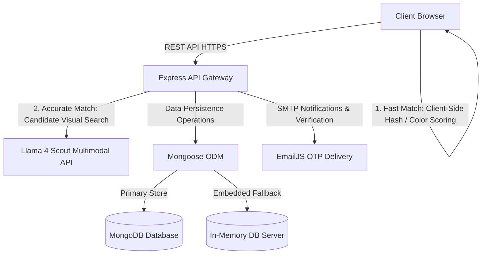

# REUNITE — The Intelligent Lost & Found Network

**FBLA Website Coding & Development (2025–2026)**
- **Developed by**: Ayaan Rustagi, Sree Kondapalli, Tushaar Singh
- **School**: Rouse High School
- **Tech Stack**: Node.js, Express, MongoDB, Vanilla JavaScript, CSS3
- **Live Demo Link / Repository**: [GitHub Repository](https://github.com/ayaanrustagi/Reunite_TheLostAndFound)

---

## Table of Contents
1. [Executive Summary](#executive-summary)
2. [Design Philosophy: "Liquid Glass" & Bento UI](#design-philosophy-liquid-glass--bento-ui)
3. [System Architecture Diagram](#system-architecture-diagram)
4. [Key Technical Features](#key-technical-features)
   - [Two-Tier Visual Search](#1-two-tier-visual-search)
   - [Fuzzy Text & Location Filtering](#2-fuzzy-text--location-filtering)
   - [The Secure Backend Gateway](#3-the-secure-backend-gateway)
   - [Real-time Audit Trail & Inbox](#4-real-time-audit-trail--inbox)
5. [Universal Design & Accessibility (WCAG 2.1)](#universal-design--accessibility-wcag-21)
6. [Codebase Organization & File Map](#codebase-organization--file-map)
7. [Installation & Local Deployment](#installation--local-deployment)
8. [Testing & Verification Guide](#testing--verification-guide)
9. [Documentation & Attributions](#documentation--attributions)

---

## Executive Summary

REUNITE is a full-stack, responsive web application designed to solve the friction of lost and found management in high-density environments like schools and community centers. Unlike static registries, REUNITE pairs an on-device perceptual matching engine with an optional AI image-matching mode to seamlessly reconnect lost reports with found inventory. Designed for compliance with the FBLA Website Coding & Development guidelines, this system focuses on visual beauty, performance, security, and accessibility.

---

## Design Philosophy: "Liquid Glass" & Bento UI

We moved away from generic templates to build a custom, cohesive design system tailored to modern aesthetic standards:

*   **Liquid Glass Theme**: Layered transparency with `backdrop-filter: blur(12px)`, subtle linear gradients, and neon accent rings to create a sense of depth and focus.
*   **Bento Grid Layout**: Dashboards use a proportional Bento Grid structure for high information density without clutter, aligning statistics, interactive feeds, and action panels.
*   **Micro-interactions**: Custom, hardware-accelerated animations using CSS `transform` and `opacity` to keep performance smooth, even on low-end mobile devices.
*   **100svh Navigation Snap**: Fully responsive mobile-first layouts designed to lock viewports and act like a native iOS/Android application.

---

## System Architecture Diagram

Below is the conceptual flow showing how the frontend, backend gateway, local database fallback, and AI models interact.



---

## Key Technical Features

### 1. Two-Tier Visual Search
REUNITE offers two distinct matching modes on the **Find Items** page:
*   **Fast (On-Device d-Hash)**: A custom-built Difference Hashing algorithm (`js/utils.js`) converts images into structural hashes and compares them using Hamming distance combined with dominant-color average scoring. Runs 100% locally in the browser with zero network footprint.
*   **Accurate (AI-Powered)**: Sends the photo and candidate inventory items to the **Groq API** running **Llama 4 Scout (multimodal)** for same-item visual comparisons. It automatically degrades gracefully to Fast mode if no API key is configured or the service is unreachable.

### 2. Fuzzy Text & Location Filtering
*   **Levenshtein Distance**: Real-time fuzzy matching accounts for typos in item titles (e.g., "Iphone" matching "iPhone").
*   **Interactive Campus Map**: Built with **Leaflet.js** to pinpoint exact coordinate locations of lost or found items, synchronized dynamically.

### 3. The Secure Backend Gateway
*   **Security Protocols**:
    *   Administrator role authorization guardrails on all queues.
    *   One-time-password (OTP) email verification using EmailJS.
    *   Payload limiting (50MB) to guard against oversized-upload abuse.
    *   HTTP security headers integrated via **Helmet** and rate-limiting using **Express Rate Limit**.

### 4. Real-time Audit Trail & Inbox
*   **System Audit Log**: Every administrative action (Approvals, Rejections, Deletions, Claims) is tracked securely.
*   **Private Messages inbox**: Direct messaging between claim requesters and administrators to facilitate pick-ups.

### 5. Arduino Smart Drop-Box Integration (Hardware Add-on)
*   **Physical Security**: Planned integration with an ESP32/Arduino-powered locker system. Found items are secured in a smart locker bay.
*   **Cloud-Synced Access**: Once an item is claimed and verified via the REUNITE web interface, the backend sends a secure IoT signal to the Arduino to unlock the corresponding physical bay for pickup.

---

## Universal Design & Accessibility (WCAG 2.1)

REUNITE features a custom accessibility settings panel that adapts the interface dynamically without page reloads:

*   **Text-to-Speech (TTS)**: Reads UI text aloud on hover or keyboard focus utilizing the HTML5 Web Speech API.
*   **Reduced Motion**: Simplifies transitions and disables non-essential animations for users with vestibular sensitivities.
*   **High Contrast Mode**: Boosts contrast ratios (exceeding WCAG AAA 7:1) for low-vision users.
*   **Dynamic Text Scaling**: Scales typography across the entire interface (80% to 150%) seamlessly.
*   **ARIA & Keyboard Support**: Logical tab indexing, skip-to-content anchors, and descriptive ARIA attributes.

---

## Codebase Organization & File Map

The codebase is structured under clean Model-View-Controller (MVC) paradigms:

```
Reunite/
├── assets/                  # Graphics and brand assets
├── backend/
│   ├── controllers/         # REST API business logic handlers
│   │   ├── auditController.js
│   │   ├── authController.js
│   │   ├── claimController.js
│   │   ├── itemController.js
│   │   └── messageController.js
│   └── models/              # Mongoose database schemas
│       ├── AuditLog.js
│       ├── Claim.js
│       ├── Item.js
│       ├── Message.js
│       └── User.js
├── css/                     # Modulized styling sheets
│   ├── base.css             # Globals, tokens, and CSS variables
│   ├── components.css       # Buttons, cards, and UI components
│   ├── responsive.css       # Breakpoints & mobile-first overrides
│   └── ...
├── js/                      # Frontend controllers & utilities
│   ├── api-client.js        # Ajax requests & local state synchronizer
│   ├── auth-flow.js         # Session and OTP logic
│   ├── ui.js                # Core navigational and accessibility actions
│   └── utils.js             # Matching calculations (d-hash, Levenshtein)
├── test/
│   └── mobile-smoke.js      # Headless Playwright layout validation tests
├── index.html               # Main app single page wrapper
├── login.html               # Dedicated account authentication portal
├── server.js                # Express server entry point
├── SOURCES.md               # Attributions and license register
└── package.json             # Node dependencies and execution scripts
```

---

## Installation & Local Deployment

### Prerequisites
*   Node.js (v18.0.0 or higher)
*   MongoDB (optional; the app falls back to an embedded in-memory database if not configured)

### Setup Steps
1. Clone the repository.
2. Install dependencies:
   ```bash
   npm install
   ```
3. Create a `.env` file in the root directory:
   ```env
   PORT=3000
   MONGO_URI="your_mongodb_connection_string"
   ADMIN_SECRET="your_custom_admin_access_code"
   EMAILJS_PUBLIC_KEY="your_emailjs_public_key"
   GROQ_API_KEY="your_groq_api_key"
   MATCH_MAX_CANDIDATES=8
   ```
4. Start the server:
   ```bash
   npm start
   ```
5. Open your browser and navigate to `http://localhost:3000`.

---

## Testing & Verification Guide

We have integrated a Playwright layout and smoke test runner to verify cross-platform responsiveness.

### Running Layout Smoke Tests
1. Install Playwright browser binaries (one-time setup):
   ```bash
   npx playwright install chromium
   ```
2. Run the automated verification script:
   ```bash
   npm test
   ```
The test script spins up a mock static server, simulates multiple devices (e.g., iPhone, iPad, Desktop), navigates to all sections, and validates:
*   No horizontal scrollbar overflows exist.
*   WebGL (Three.js) canvas initializes correctly.
*   No uncaught runtime JavaScript exceptions are fired.

---

## Documentation & Attributions

For a complete breakdown of asset licenses, third-party libraries, and external fonts, please refer to [SOURCES.md](./SOURCES.md). All core styling, visual matching algorithms, and UI flows are fully original works.
